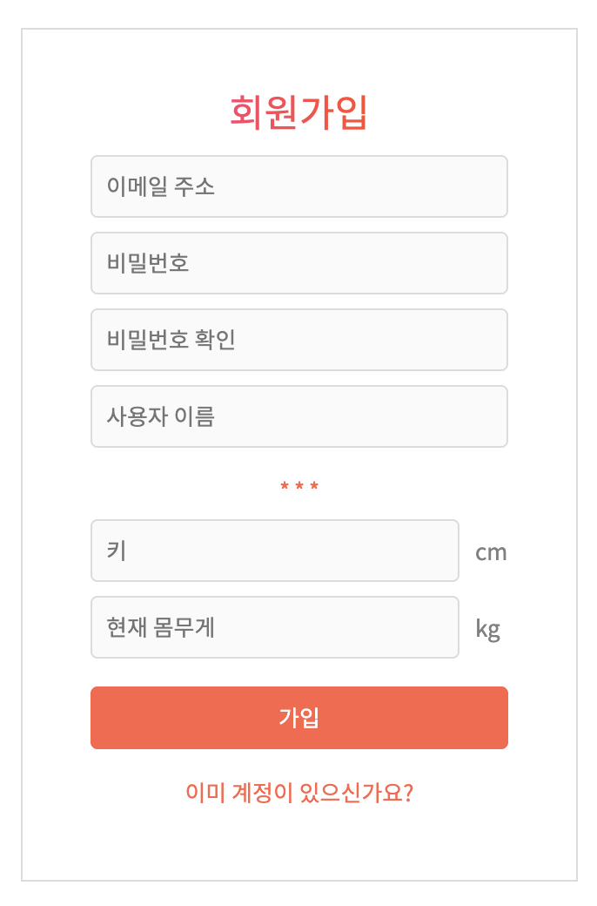
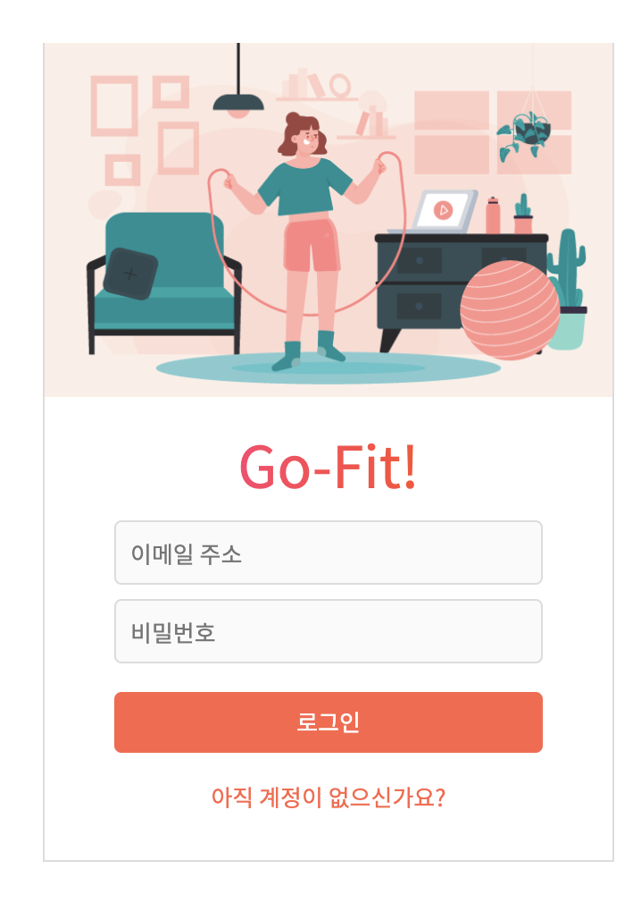
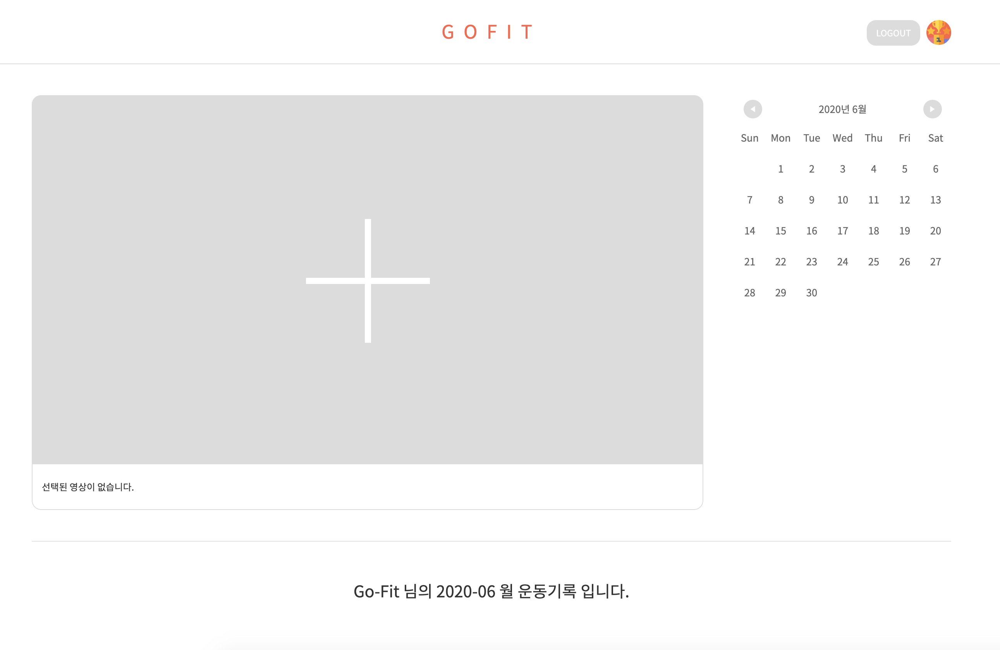

# GoFit-Client

GoFit-Client is a Web-Application for 'Home-Fitness' challengers with easy usability and brilliant UI.

Challengers can watch 'Home-Fitness' Youtube video and leave a daily fitness logs and health logs. The workout date marked on calendar and daily workout logs can help challengers to keep doing 'Home-Fitness' everyday.

## Table of Contents

- [Setup](#Setup)
- [Technologies](#Technologies)
- [Features](#Features)
- [Usage](#Usage)

## Setup

To run this project, install it locally using npm:

```
$ cd ../GoFit-Client
$ npm install
$ npm start
```

## Technologies

Project is created with:

- react: 16.13.1
- react-youtube: 7.11.2
- redux: 4.0.5
- redux-saga: 1.1.3
- immer: 6.0.5
- moment: 2.25.3
- styled-components: 5.1.0
- formik: 2.1.4

## Features

Home-Fitness Challengers can:

- Sign-up and sign-in the Go-Fit.
- Search Home-Traning Youtube Video.
- Select and play Youtube video.
- Write a daily log including feeling, weight, daily water intake and tags.
- Check the workout records with calendar and daylogs.
- See workout recoords of caledar and daylogs of previos month.
- Get filtered daylogs and videos with clicking Tags or specific date.
- Get motivation through Weekly Top7 in the Ranking.
  Who has most longest workout records on the week!

## Usage

1. Signup


- Fill up the information.

2. Login


- Login GoFit with Email and Password.

3. Main Page


- Click the + button to select the Youtube.
- Watch and follow the Youtube.
- Write a Daylog with your feeling, weight, water intake and tags.

## Things Todo

- 비밀번호 잊었을때 비밀번호 초기화 링크 전송 기능
- 월별 누적 시간, 몸무게, BMI 그래프로 보여주기

## Thanks to

- Icons made by [Freepik](https://www.flaticon.com/authors/freepik) from [www.flaticon.com](https://www.flaticon.com/)

